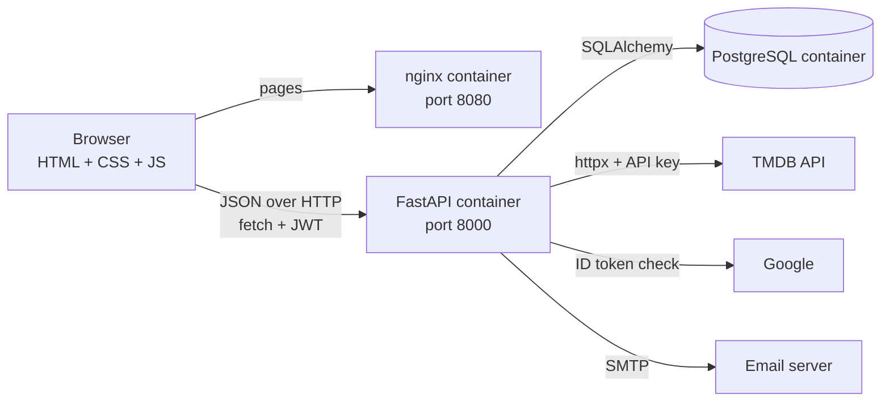
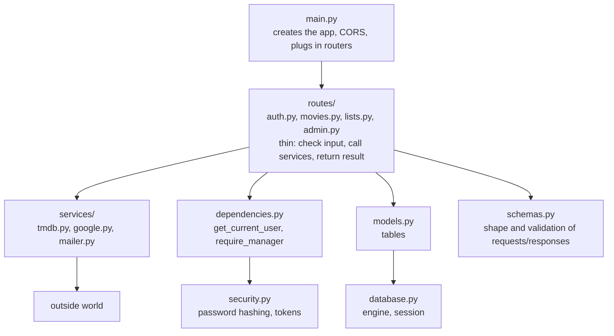
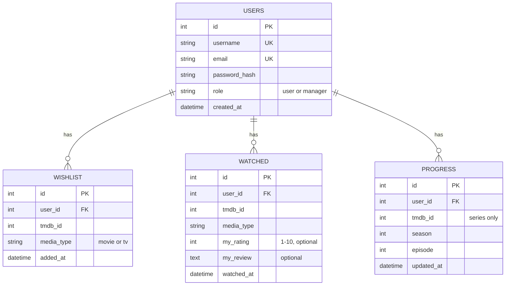
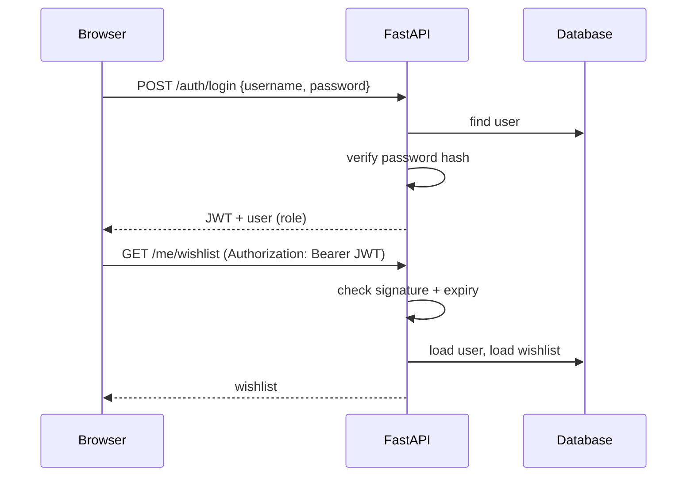
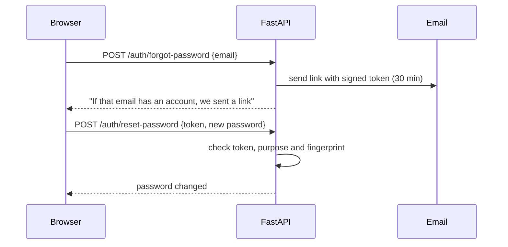

# Framerate - Project Book

**Student:** Moshe  **Project:** Full-stack finals project  **Date:** October 2026

> Screenshots go in `docs/screenshots/` (suggested list in section 12). The diagrams below are
> written in Mermaid, which GitHub renders automatically. To get images for Word/PDF, paste a
> diagram into https://mermaid.live and export it.

---

## 1. Introduction

**Framerate** is a website for tracking movies and TV series. A visitor can browse trending and
popular titles, search, and see details (cast, rating, where to watch). A registered user can keep a
wishlist, mark titles as watched with a personal rating and review, and save which season and
episode of a series they are on. A manager has an admin page with statistics and user management.

**Why this idea:** it uses real data from an external API, it needs real users with different
permissions, and every feature maps to a simple database table.

## 2. Project requirements and where they are met

| Requirement | How Framerate meets it |
|---|---|
| Login with two roles (manager + regular user) | Register/login with JWT tokens. Roles `user` and `manager`. Manager-only API routes and a manager-only admin page. |
| Frontend | Plain HTML, CSS and JavaScript (10 pages), served by nginx. |
| Backend | FastAPI (Python) REST API. |
| Database | PostgreSQL (SQLite for local development), accessed with SQLAlchemy. |
| External API | TMDB (The Movie Database): search, popular, trending, details, cast, streaming providers, episodes. |
| Project book | This document. |
| Extras | Sign in with Google, forgot-password by email, Docker Compose deployment. |

## 3. Architecture

Three containers run with one command (`docker compose up --build`):

- **frontend** (nginx): serves the static files.
- **backend** (FastAPI): all logic and security. It is the only part that talks to the database and to TMDB.
- **db** (PostgreSQL): stores users and their lists. Data lives in a Docker volume, so it survives restarts.

**Important design decision:** the TMDB key stays on the server. The browser never sees it; it asks
our backend, and the backend asks TMDB.

**Backend layers** (each file does one job):

## 4. Technologies and why

| Choice | Reason |
|---|---|
| **FastAPI** | Automatic input validation (Pydantic), automatic interactive docs at `/docs`, simple readable code. |
| **SQLAlchemy** | Tables are Python classes, so no hand-written SQL, and the same code works on SQLite and PostgreSQL. |
| **PostgreSQL** | A real production database; fits the Docker setup. |
| **PyJWT** | Signed login tokens. |
| **httpx** | Calls to TMDB and Google. |
| **Plain JS (no framework)** | Small enough to explain line by line; shows how the browser talks to an API. |
| **Docker Compose** | One command starts everything the same way on any machine. |

## 5. Database design

**Key decision: there is no "movies" table.** We store only the TMDB id and the user's own data.
Title, poster and description are fetched live from TMDB. This avoids copying and outdated data, and keeps
the database small.

**Integrity rules** (enforced by the database, not only by code):

- `users.username` and `users.email` are unique.
- `UNIQUE (user_id, tmdb_id, media_type)` on wishlist and watched: a title cannot be added twice.
- `UNIQUE (user_id, tmdb_id)` on progress: one row per series per user.
- `user_id` is a foreign key with `ON DELETE CASCADE`: deleting a user deletes their lists.

## 6. API reference

All paths start with `/api`. "Login" = needs a valid token. Interactive docs: `http://localhost:8000/docs`.

| Method and path | Access | What it does |
|---|---|---|
| `POST /auth/register` | public | Create a user (role is always `user`). |
| `POST /auth/login` | public | Returns a JWT and the user. |
| `GET /auth/me` | login | The current user. |
| `GET /auth/config` | public | Tells the site whether Google sign-in is configured. |
| `POST /auth/google` | public | Log in or register with a Google ID token. |
| `POST /auth/forgot-password` | public | Emails a reset link (same answer for unknown emails). |
| `POST /auth/reset-password` | public (token) | Sets a new password using the emailed token. |
| `GET /titles/search?q=&page=` | public | Search movies and series. |
| `GET /titles/popular?media_type=` | public | Popular movies or series. |
| `GET /titles/trending` | public | Trending this week. |
| `GET /titles/{movie\|tv}/{id}` | public | Details, cast, where to watch. |
| `GET /titles/tv/{id}/season/{n}` | public | Episodes of a season. |
| `GET/POST /me/wishlist`, `DELETE /me/wishlist/{type}/{id}` | login | The user's wishlist. |
| `GET /me/watched`, `PUT/DELETE /me/watched/{type}/{id}` | login | Watched list with rating and review. |
| `GET /me/progress`, `PUT/DELETE /me/progress/{id}` | login | Episode progress for series. |
| `GET /me/status/{type}/{id}` | login | Wishlist/watched/progress state of one title. |
| `GET /admin/users` | manager | All users. |
| `DELETE /admin/users/{id}` | manager | Delete a user (not yourself). |
| `GET /admin/stats` | manager | Counts, average rating, top 5 most watched. |

Status codes used: 200/201/204 success, 400 bad request, 401 not logged in or bad token, 403 not a
manager, 404 not found, 409 conflict (duplicate), 422 invalid input (automatic), 502 TMDB/Google
unreachable, 503 a feature is not configured.

## 7. Security

1. **Passwords are never stored.** Only a PBKDF2-HMAC-SHA256 hash with a random salt and 600,000
   iterations. Verification uses a constant-time comparison.
2. **Login tokens (JWT).** After login the server signs a token containing the user id, the role and
   an expiry (1 hour). The browser sends it as `Authorization: Bearer ...`. Only our secret key can sign
   it, so it cannot be forged.
3. **Roles are checked on the server.** `require_manager` protects the whole admin router. The user is
   loaded from the database on every request, so a deleted user's old token stops working. Hiding the
   Admin link in the frontend is only convenience, never the protection.
4. **The role never comes from the client.** The register form has no role field; the first manager is created
   at startup from environment variables.
5. **Same message for "no such user" and "wrong password"**, so attackers cannot discover usernames.
6. **Input validation** with Pydantic on every request (lengths, patterns, number ranges).
7. **SQL injection:** impossible by construction, because all queries go through SQLAlchemy with bound parameters.
8. **XSS:** the frontend builds pages with `textContent`/DOM functions, never by pasting text from the
   internet into HTML, so a movie title or a review cannot run code.
9. **Secrets** (TMDB key, JWT secret, database password, SMTP password) live in `.env`, which is excluded
   from Git and from the Docker image.
10. **CORS** allows only the site's own addresses to call the API from a browser.
11. **Password reset:** the link contains a signed token that expires after 30 minutes, is marked
    `purpose=reset` (a login token cannot be used as one), and includes a fingerprint of the current password,
    so it works only once. The form answers the same way whether or not the email exists.
12. **Google sign-in:** the backend asks Google to verify the ID token, checks that it was issued for *our*
    client ID and that the email is verified. Only then does it log the user in (creating the account if needed).

**Known limits (honest list):** the token is kept in `localStorage`, so a successful XSS attack could read it
(mitigated by point 8); there is no login rate-limiting; the API is served over plain HTTP, so a real deployment
would put HTTPS in front of it.

## 8. Authentication flows

## 9. Frontend

**Pages:** Home, Search, Details, Wishlist, History, Admin, Login, Register, Forgot password, Reset password.

**Structure:** every page has the same skeleton (navbar, main, footer) and loads the same three shared scripts, then
its own script:

- `api.js`: `api()` function that adds the token, handles errors (a 401 logs you out), and stores the login in `localStorage`.
- `ui.js`: helpers that build elements safely, the title card, toasts, empty and loading states.
- `auth.js`: `initPage()` builds the navbar for the current user and protects pages (login-only or manager-only).

**Design:** "Pop Sticker, Cobalt": thick black outlines, hard offset shadows, flat colors, rounded corners; a
palette of only chalk, white, ink, cobalt, tangerine and sky (defined as CSS variables in `style.css`).
Accessibility: real buttons/links/labels, alt text, visible focus ring, state shown with text/icons and not color alone,
44px touch targets, responsive layout down to phone width.

**Why plain JavaScript:** every behaviour can be read top to bottom, which makes the code explainable.

## 10. The external API (TMDB)

The backend calls TMDB's v3 API with `httpx`. `services/tmdb.py` reshapes TMDB's responses into one simple format
(movies and series name fields differently, for example `title` vs `name`). One request for details also asks for cast and
streaming providers (`append_to_response`). List endpoints fetch many titles in parallel (8 threads) so a
wishlist of 20 titles is not 20 slow requests in a row. If one title cannot be loaded, a placeholder is shown instead of
breaking the whole list. TMDB's required attribution appears in the footer of every page.

## 11. Deployment with Docker

- `backend/Dockerfile`: Python 3.12 slim image, installs requirements first (so rebuilds are fast), runs `uvicorn`.
- `frontend/Dockerfile`: nginx image with the site files copied in.
- `docker-compose.yml`: `db` (with a health check and a volume), `backend` (waits for the database to be healthy), `frontend`.
  Settings come from `.env` through `${...}` variables.
- Run: `docker compose up --build`. Site on port 8080, API on 8000.

## 12. Testing

Manual test checklist (tick each one and add a screenshot):

- [ ] Register a user; duplicate username/email is rejected.
- [ ] Login with wrong and right password.
- [ ] A regular user gets 403 on `/api/admin/stats`; the manager gets the data.
- [ ] Search, details, season episodes.
- [ ] Add to wishlist; adding again shows "Already in your wishlist".
- [ ] Mark as watched with a rating; it leaves the wishlist; it appears in History.
- [ ] Save series progress; "I'm here" on an episode.
- [ ] Admin: statistics, delete a user; deleting yourself is refused.
- [ ] Forgot password: the link appears in the log (or email); the new password works; the same link a second time is refused.
- [ ] Sign in with Google (if configured).
- [ ] Restart with `docker compose up`: data is still there.

Interactive API testing is available at `/docs`. The frontend flows were also tested with an automated headless-browser script against a mock API.

## 13. Problems and how they were solved

- **Windows Application Control blocked a compiled library** (SQLAlchemy 2.1): pinned `sqlalchemy<2.1` and chose pure-Python libraries (httpx).
- **Switched from Flask to FastAPI** for built-in validation and automatic docs.
- **Where to keep the TMDB key:** moved all TMDB calls to the backend so the key never reaches the browser.
- **Slow lists:** parallel requests with a thread pool.

## 14. Possible improvements

Recommendations based on ratings, following other users, HTTPS with a reverse proxy, rate limiting on login,
refresh tokens, automated backend tests, email verification at registration.

## 15. Questions to expect (short answers)

- **Why JWT?** The server stays stateless: the token itself proves the identity and role, signed so it cannot be forged.
- **How do you stop a user becoming a manager?** The role is never read from the request; it comes from the database. Registration always creates `user`.
- **What if someone changes the Admin link in the browser?** Nothing: the API checks the role on every admin request.
- **Why not store movies in your DB?** Avoids duplicating and outdated data; we keep only what belongs to the user.
- **Where is the API key?** In `.env` on the server. Never sent to the browser, never in Git.
- **How is a password stored?** Salted PBKDF2 hash, never the password.
- **What does the Docker volume do?** Keeps PostgreSQL data when containers are removed.
- **What happens when TMDB is down?** The backend returns 502 and the site shows a readable error message.
